# JarvisPLOT Architecture Overview

Status: implemented

This document captures the runtime architecture that shipped in JarvisPLOT 1.3.0 and is being consolidated for the 1.3.1 documentation release.

The main architectural constraint is deliberate: JarvisPLOT must keep a narrow, selection-table pipeline. Full source tables must not flow through runtime profiling, cache storage, or layer rendering by default.

## Core Components

| Module | Main responsibilities | Key entry points |
| --- | --- | --- |
| `jarvisplot/core.py` | Top-level orchestration: CLI setup, YAML load, workdir/cache init, dataset registration, required-column planning, prebuild pass, figure loop | `JarvisPLOT.init()`, `JarvisPLOT.load_path()`, `jarvisplot/core_runtime.py:plan_dataset_required_columns()`, `jarvisplot/core_runtime.py:prepare_project_layout()`, `jarvisplot/core_runtime.py:prepare_usage_plan()`, `prebuild_profile_pipelines()`, `plot()` |
| `jarvisplot/data_loader.py` | CSV/Parquet loading, dataset lifecycle, stable row ids, late row/column fetch, HDF5 call-through | `DataSet.load()`, `load_hdf5()`, `load_parquet()`, `fetch_rows_columns()` |
| `jarvisplot/data_loader_summary.py` | dataframe summary formatting and HDF5 tree diagnostics | `dataframe_summary()`, `print_hdf5_tree_ascii()` |
| `jarvisplot/data_loader_runtime.py` | Runtime HDF5/Parquet loading, materialization, and dataset transform execution | `load_hdf5()`, `load_parquet()`, `load_hdf5_materialized()`, `apply_dataset_transform()` |
| `jarvisplot/Figure/preprocessor.py` | Projection planning, preprofile prebuild, pipeline cache compatibility, demand-based enrichment | `DataPreprocessor.prebuild_profiles()`, `_runtime_projection()`, `_runtime_cache_columns()`, `_enrich_for_demand()` |
| `jarvisplot/Figure/preprocessor_runtime.py` | Runtime source resolution and transform application | `resolve_source_data()`, `apply_transforms_impl()`, `run_pipeline()` |
| `jarvisplot/Figure/figure.py` | Figure assembly, layer queueing, runtime data loading, `share_data` reuse, coordinate evaluation, adapter dispatch, rendering | `Figure.layers`, `Figure.from_dict()`, `Figure.plot()` |
| `jarvisplot/cache_store.py` | Workdir-local cache store for pipeline payloads, summaries, named shared data, and materialized parquet manifests | `ProjectCache.put_dataframe()`, `get_dataframe()`, `put_named_reference()`, `put_materialized_manifest()` |
| `jarvisplot/memtrace.py` | Opt-in memory tracing: RSS checkpoints, dataframe shape/backend tokens, large-object inventory, cache file checkpoints | `memtrace_checkpoint()`, `memtrace_object_inventory()`, `memtrace_file_checkpoint()` |

Supporting infrastructure:

- `jarvisplot/Figure/data_pipelines.py` provides `SharedContent` and `DataContext`, the session-level lazy data registry used by `core.py`, `preprocessor.py`, and `figure.py`.
- `jarvisplot/Figure/preprocessor_runtime.py` holds runtime source resolution and transform execution helpers extracted from `preprocessor.py`.
- `jarvisplot/Figure/preprocessor_runtime.py` contains the concrete transform primitives used by both the prebuild path and the runtime path.
- `jarvisplot/Figure/profile_runtime.py` contains the concrete profiling and preprofiling algorithms used by both phases.
- `jarvisplot/Figure/method_registry.py` defines how YAML `method` keys resolve to rectangular or ternary rendering behavior.
- `jarvisplot/Figure/adapters_rect.py` and `jarvisplot/Figure/adapters_ternary.py` carry the adapter-family implementations.
- `jarvisplot/core_assets.py` centralizes colormap, interpolator, and style bootstrap helpers.
- `jarvisplot/utils/pathing.py` centralizes `&JP/` and workdir-relative path resolution.
- `jarvisplot/data_loader_hdf5.py` centralizes HDF5 whitelist, rename, and materialization helpers.
- `jarvisplot/data_loader_summary.py` centralizes dataframe summary formatting and HDF5 tree diagnostics.
- `jarvisplot/Figure/style_runtime.py`, `jarvisplot/Figure/layout_runtime.py`, and `jarvisplot/Figure/colorbar_runtime.py` hold the helper logic extracted from the main figure runtime.

## Component Interaction

1. `JarvisPLOT.init()` parses CLI args, initializes the logger, loads colormaps, and loads the user YAML.
2. `jarvisplot/core_runtime.py:prepare_project_layout()` resolves `project.workdir` and creates `ProjectCache` under `<workdir>/.cache/`.
3. `JarvisPLOT.load_dataset(eager=False)` registers each `DataSet` lazily (no data read yet).
4. `jarvisplot/core_runtime.py:plan_dataset_required_columns()` scans figure layers and transforms to decide:
   - which columns a dataset must be able to compute (`required_columns`)
   - which columns are explicitly kept or dropped by ordered dataset transforms
5. `SharedContent` and `DataContext` are created; each `DataSet` is registered in `DataContext` with a lazy loader and a release callback.
6. `jarvisplot/core_assets.py:load_interpolators()` registers lazy `InterpolatorManager` hooks for YAML `Functions` in the expression runtime.
7. `DataPreprocessor` is created with the `DataContext`, `ProjectCache`, and dataset registry.
8. `DataPreprocessor.prebuild_profiles()` rewrites eligible first-profile transforms into cached `__jp_preprofile_<hash>` aliases so repeated profile-heavy layers do not repeat the same expensive reduction.
9. `jarvisplot/core_runtime.py:prepare_usage_plan()` counts how many times each shared source is consumed across all figures, enabling release-after-last-use.
10. `jarvisplot/core_assets.py:load_styles()` returns the style bundle map from `cards/`, and `core.py` stores it on `self.style`.
11. `JarvisPLOT.plot()` iterates over YAML `Figures`. For each figure:
    - creates a `Figure` instance and wires context, preprocessor, styles, and logger
    - `Figure.from_dict(fig_dict)` applies config, creates axes, and queues layers
    - `Figure.plot()` runs `DataPreprocessor.run_pipeline()` per layer, then renders
12. `DataPreprocessor.run_pipeline()` for each layer:
    - resolves the source from `DataContext`
    - keeps only projected columns
    - applies runtime transforms
    - caches the narrow result
    - enriches missing render-only columns on demand
13. `jarvisplot/Figure/layer_runtime.py:render_layer()` evaluates coordinate expressions and dispatches to the rectangular or ternary adapter.

## Runtime Dataflow

The runtime pipeline is intentionally narrow:

```mermaid
flowchart LR
    A["Source file<br/>CSV / HDF5 / Parquet"] --> B["Dataset planning<br/>required_columns + explicit prune"]
    B --> C["Lazy pushdown<br/>whitelist / rename / filter / sort / add_column"]
    C --> D["Collect"]
    D --> E["Compact dataset table<br/>DataSet.data + __jp_row_idx__"]
    E --> F["Selection table projection<br/>runtime/preprofile base projection"]
    F --> G["profile / preprofile / grid_profile"]
    G --> H["Compact pipeline cache<br/>.cache/data or named ref"]
    H --> I["Layer-demand enrichment<br/>fetch_rows_columns(row_idx, missing_cols)"]
    I --> J["Rendering<br/>jarvisplot/Figure/layer_runtime.py:render_layer()"]
```

### What each stage means in code

- Dataset planning lives in `jarvisplot/core_runtime.py:plan_dataset_required_columns()`.
- Lazy pushdown happens mainly in `jarvisplot/data_loader_runtime.py:load_hdf5_materialized()`, `jarvisplot/data_loader_runtime.py:_apply_dataset_transform_polars()`, and `DataSet.load_parquet()`.
- The compact dataset table is the post-load `DataSet.data` object plus `__jp_row_idx__` after ordered transforms have run.
- Selection-table projection is enforced by `DataPreprocessor._runtime_projection()`, `_runtime_cache_columns()`, and `_preprofile_base_projection()`.
- Profiling is executed by `_preprofiling()`, `profiling()`, and `grid_profiling()` in `jarvisplot/Figure/profile_runtime.py`.
- Layer-demand enrichment is performed by `DataPreprocessor._enrich_for_demand()` using `DataSet.fetch_rows_columns()`.

## Prebuild Branch

`DataPreprocessor.prebuild_profiles()` adds a second, pre-render branch for expensive profile layers:

1. Split the first `profile` step into:
   - a prebuild transform (`pre_transform`)
   - the remaining runtime transform tail
2. Cache the prebuild output by a key that depends only on source plus profile coordinates, not on runtime `bin`, `method`, or `objective`
3. Rewrite the layer source to a synthetic alias such as `__jp_preprofile_...`
4. Let runtime `run_pipeline()` continue from that alias

This is why 1.3.0 can reuse the same preprofile selection table across multiple layers or across profile parameter tweaks that do not change the base coordinate demand.

## Cache Layout

`ProjectCache` stores four different artifact classes under `<workdir>/.cache/`:

- `data/`: pipeline payloads plus metadata JSON
- `named/`: `share_data` artifacts or references to `data/`
- `summary/`: human-readable source summaries
- `materialized/`: HDF5-to-parquet materialization slots

The critical rule is that runtime cache entries are not raw source snapshots. They are the projected output of the pipeline after transform execution.

## Architectural Invariants

- `__jp_row_idx__` is the stable row identity used to reconnect narrow runtime payloads to retained dataset columns.
- Dataset loading may be wide internally while scanning an HDF5 group, but the in-memory dataframe and runtime cache payload must follow the explicit transform contract and stay narrow where possible.
- Profiling is a data-reduction stage and should run on selection tables, not on full source tables.
- Rendering is the only stage that is allowed to ask for additional display-only columns; if those columns are not already in the current narrow payload, row-id based enrichment supplies them.
