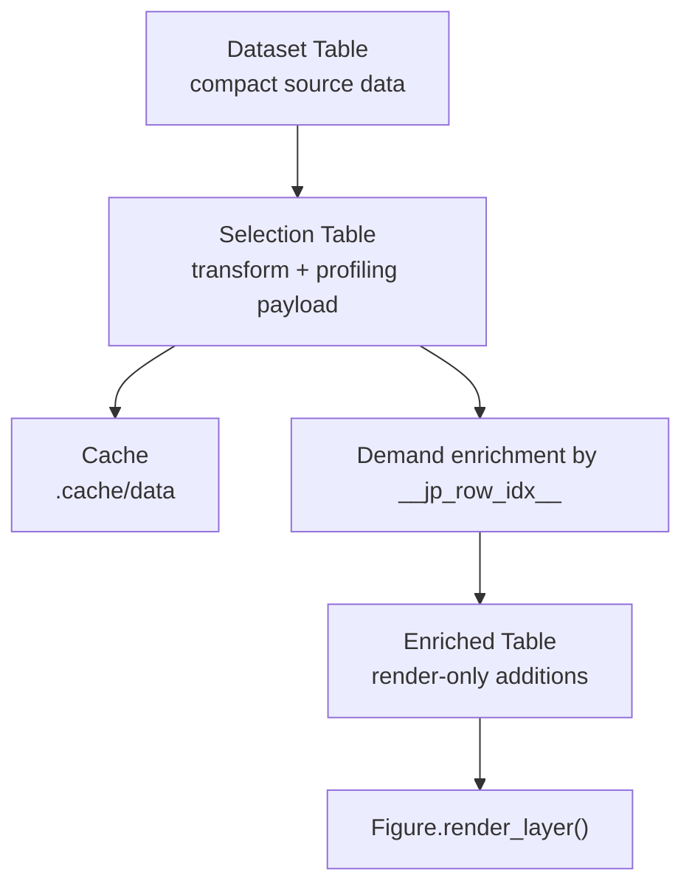

# JarvisPLOT Dataflow Architecture

Status: implemented

JarvisPLOT 1.3.0 replaced the old wide-table pipeline with a three-table model. The code does not expose these as separate classes, but the distinction is enforced by how `core.py`, `data_loader.py`, `data_loader_summary.py`, `data_loader_runtime.py`, `data_loader_hdf5.py`, `Figure/preprocessor.py`, and `Figure/preprocessor_runtime.py` project, cache, and enrich data.

## The Three Table Types

| Table type | Where it exists in code | Purpose | Allowed width |
| --- | --- | --- | --- |
| Dataset Table | `DataSet.data` in `jarvisplot/data_loader.py` (runtime loading/materialization helpers in `jarvisplot/data_loader_runtime.py`) | Dataset load output after ordered dataset-level transforms | Narrow by explicit transform only |
| Selection Table | Output of `DataPreprocessor.run_pipeline()` before demand enrichment | Input to `profile`, `preprofile`, and `grid_profile`; compact cache payload | Narrow, profiling columns plus current-layer demand |
| Enriched Table | Output of `DataPreprocessor._enrich_for_demand()` and then `Figure.render_layer()` | Rendering, layer style evaluation, `share_data`, export-oriented use | Add only layer-requested columns |

## 1. Dataset Table

The dataset table is the compact source representation held by `DataSet`.

Properties:

- Created by `DataSet.load_csv()` or `DataSet.load_hdf5()`
- Always includes `__jp_row_idx__` once the dataset becomes runtime-visible
- Follows the dataset `transform` list strictly in YAML order
- Only explicit `keep_columns` / `drop_columns` steps prune columns
- If no pruning step appears in `transform`, no implicit column pruning is applied
- May originate from:
  - CSV loaded directly to pandas
  - HDF5 materialized to `.cache/materialized/<key>/part-*.parquet`, then exposed as a polars lazy scan before the pandas boundary
- Sits on the polars-to-pandas boundary:
  - HDF5 path prefers `polars` lazy pushdown and only collects the kept columns
- HDF5 whitelist / rename / manifest helpers live in `jarvisplot/data_loader_hdf5.py`
- summary formatting and tree diagnostics live in `jarvisplot/data_loader_summary.py`
- runtime loading/materialization helpers live in `jarvisplot/data_loader_runtime.py`
  - downstream transform/render code still consumes pandas dataframes

What must be in it:

- `__jp_row_idx__`
- dataset-transform outputs produced by ordered `transform` steps
- any columns explicitly preserved by `keep_columns`
- any columns needed later by runtime stages before a later explicit pruning step

What must not be in it by default:

- every raw source column from a wide HDF5 group
- columns that are only needed by unrelated layers
- columns that have not been explicitly pruned by the transform list

## 2. Selection Table

The selection table is the narrow working table used by profiling and cache storage.

In the current implementation, it is created by:

- `DataPreprocessor._preprofile_base_projection()` for prebuild work
- `DataPreprocessor._runtime_projection()` for runtime work
- `DataPreprocessor._runtime_cache_columns()` before cache storage

Properties:

- Narrow schema by design
- Contains `__jp_row_idx__`
- Contains only the columns needed to execute transforms, profiling, and the current layer's known demand
- Is the object cached in `.cache/data/<key>.pkl`
- Is the input to:
  - `profile`
  - `_preprofiling`
  - `grid_profile`

Typical contents:

- `__jp_row_idx__`
- profile keys such as `x`, `y`, `z`, `left`, `right`, `bottom`, or configured axis names
- objective column used by `profile` or `grid_profile`
- helper transform outputs added earlier in the pipeline
- current-layer coordinate/style columns when they were part of the projected demand
- grid helper columns for `grid_profile`, for example:
  - `__grid_ix__`
  - `__grid_iy__`
  - `__grid_bin__`
  - `__grid_xmin__`, `__grid_xmax__`
  - `__grid_ymin__`, `__grid_ymax__`
  - `__grid_xscale__`, `__grid_yscale__`
  - `__grid_objective__`
  - `__grid_empty_value__`

What it must not contain:

- the full dataset table
- unused source columns
- unrelated style or source columns that are not part of the current layer demand

### Preprofile Behavior

`DataPreprocessor.prebuild_profiles()` is an important part of the selection-table model.

- It finds the first `profile` step in a transform chain.
- It builds a reusable preprofile table with `_preprofiling()`.
- `_preprofiling()` keeps representative rows per cell for both local maxima and minima, so later runtime objective changes can reuse the same reduced table.
- The layer source is rewritten to `__jp_preprofile_<hash>`, and only the remaining runtime transform tail is left in the layer config.

That means the prebuild cache is a reusable selection table, not a rendered artifact.

## 3. Enriched Table

The enriched table is the selection table plus any render-only columns that a layer still needs.

This happens in `DataPreprocessor._enrich_for_demand()` when the current narrow payload still lacks some render-time columns:

1. Inspect `demand_columns` derived from layer coordinate and style expressions
2. Detect columns missing from the current selection table
3. Resolve the base dataset source
4. Call `DataSet.fetch_rows_columns(row_ids, missing_columns, row_key="__jp_row_idx__")`
5. Merge only those missing columns back into the narrow table

Properties:

- Used only at the render boundary
- Keyed by `__jp_row_idx__`
- Adds columns lazily instead of propagating them through the whole pipeline
- For HDF5 materialized datasets, can fetch from the retained pandas dataframe first and from the full polars lazy frame if necessary

This table is appropriate for:

- `Figure.render_layer()`
- style expression evaluation
- adapter methods that need a few extra columns at draw time
- `share_data` reuse when the shared payload is a render-ready dataframe

It is not the right input for new profiling stages. If a transform or profiling step needs a column, that column belongs in the selection-table projection, not in late enrichment.

## Lifecycle Summary

## Guardrails

- Plan column demand early in `core.py`.
- Keep runtime caches compatible with narrow projections only.
- Dataset-level `transform` is ordered; do not reorder steps during planning or execution.
- `keep_columns` and `drop_columns` are the only explicit column-pruning steps.
- `tocsv` and `to_parquet` execute at their position in the ordered transform list and export the dataframe state at that point.
- If an export step is last, the runtime can avoid extra downstream transform work after the export.
- If a new transform introduces new input or output columns, update the projection logic in both `core.py` and `Figure/preprocessor.py`.
- If a new layer needs extra render columns, express that need in layer coordinates or style expressions so demand enrichment can discover it.
